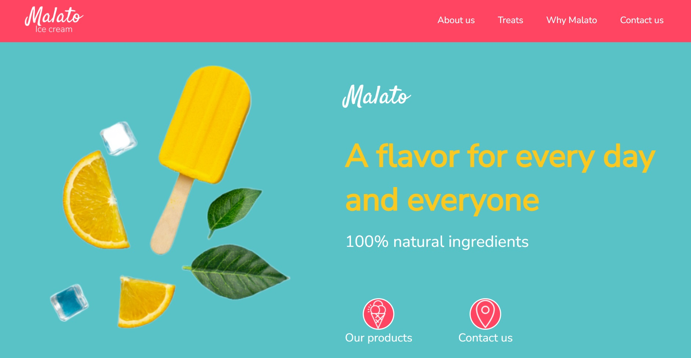

# Malato Ice Cream

This is a fully-responsive website of a wonderful ice-cream shop. 

<a href="https://malato-ice-cream.netlify.app/"><strong>➥ Live Demo</strong></a> 

## Description

The project consists of the front page and ***several sections: About us, Treats, Why Malato, Contact us***.

The purpose of this project was to train my skills in **Figma** and then, to use the final design for creating a nice website.

Moreover, I also practiced JavaScript to make **a responsive fixed top navbar** with redirection to corresponding website sections as well as GSAP and AOS (Animated On Scroll Library) **to animate images and words**.

**Parallax Scrolling effects**, **the :hover selector** on buttons and **the rotate() method** on some elements are also contribute to the website appearance.

### Built with

- HTML5
- CSS3
- Flexbox
- JavaScript
- [GSAP](https://gsap.com/)
- [AOS](https://michalsnik.github.io/aos/)

### Screenshots

## License

This project is **free to use** and does not contain any license.
